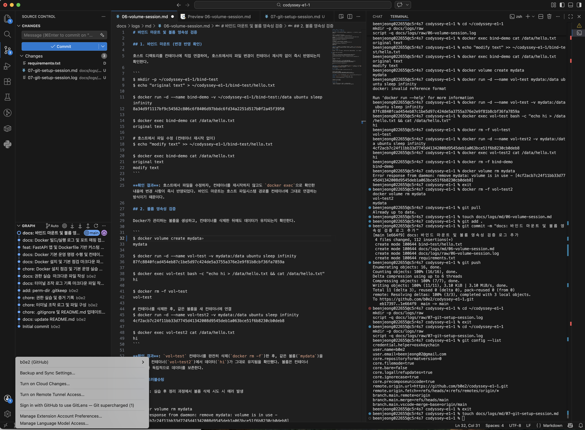

# Git 설정 및 GitHub 연동

## 수행 명령 및 결과

```
$ git config --list
credential.helper=osxkeychain
user.name=b0e2
user.email=beenjeong02@gmail.com
core.repositoryformatversion=0
core.filemode=true
core.bare=false
core.logallrefupdates=true
core.ignorecase=true
core.precomposeunicode=true
remote.origin.url=https://github.com/b0e2/codyssey-e1-1.git
remote.origin.fetch=+refs/heads/*:refs/remotes/origin/*
branch.main.remote=origin
branch.main.merge=refs/heads/main
branch.main.vscode-merge-base=origin/main
```

## GitHub Push (원격 반영)

로컬 커밋을 GitHub 원격(`origin/main`)으로 push한 실제 출력이다.

```
$ git push origin main
오브젝트 나열하는 중: 17, 완료.
오브젝트 개수 세는 중: 100% (17/17), 완료.
Delta compression using up to 8 threads
오브젝트 압축하는 중: 100% (8/8), 완료.
오브젝트 쓰는 중: 100% (9/9), 2.12 KiB | 2.12 MiB/s, 완료.
Total 9 (delta 6), reused 0 (delta 0), pack-reused 0 (from 0)
remote: Resolving deltas: 100% (6/6), completed with 6 local objects.
To https://github.com/b0e2/codyssey-e1-1.git
   e27ce78..9d9c9bc  main -> main
```

push 출력의 `To https://github.com/b0e2/codyssey-e1-1.git` 및 `main -> main` ref 갱신으로 로컬 커밋이 원격에 반영됨을 확인했다.

## 확인한 항목

- Git 사용자 정보 설정 완료: `user.name=b0e2`, `user.email=beenjeong02@gmail.com`
- `git push origin main` 실행 출력으로 원격(GitHub) 반영 확인
- 기본 브랜치 설정 확인: `branch.main.remote=origin`, `branch.main.merge=refs/heads/main`
- 원격 저장소(GitHub) 연동 확인: `remote.origin.url=https://github.com/b0e2/codyssey-e1-1.git`
- VSCode에서 GitHub 로그인 및 저장소 연동 완료 (스크린샷 첨부)

## VSCode GitHub 연동 증거

